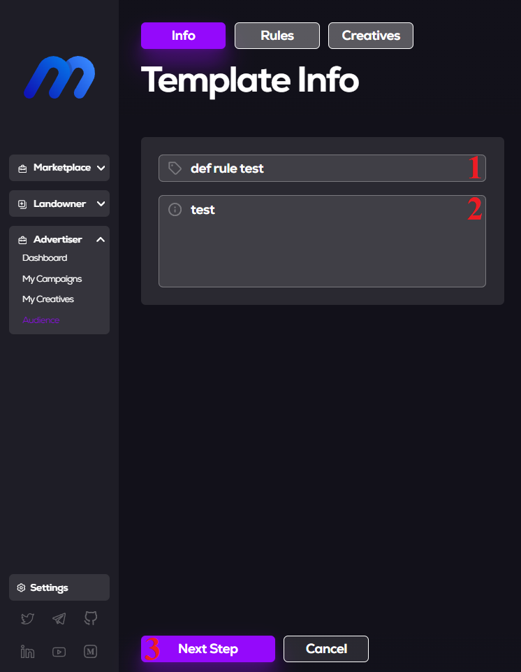

# Audience Creation

## Introduction
    This document is an instruction on how to work with audiences and how create it.

## 1. Opening the [**MetaAds**](https://metaads.team/main/) website

* Connect
* Click on **Advertiser** 
* Click on **Audience**

## 2. Creating an **Audience** with default rule

* Click on *New template* button

##

* Enter *Name*
* Enter *Describe*
* Click on *Next Step* button

##

* Click on the *+* button (1)
* Select your *Creative (image, video, stream)* (2)
* Select: if *the Image* - how long it will be shown (you can choose seconds, minutes, hours), if *the Video* - how many times it will be shown (maximum - 4) (3)
* Click on *Save & To Rules List* button (4)

> After these actions, you will return to the previous page - choosing rules. Just click the *Save and Quit* button.
##

    Ready! The Audience has been created and is already displayed on the page. 

## 3. About **Audiences**

As you noticed, when creating an **audience**, there is a choice of rules. There are several of them: *User transactions min, User balance min, Average transaction min, First user transaction, Last user transaction, Minimal transaction, Maximum transaction, User geo-position, Usertoken balance min*. Selecting any rule from this list means that the **audience** is intended for specific users.

That is:

**User transactions min** - the rule will work if  user has made at least transactions using current wallet.

**User balance min** - the rule will work if user has at least ...ETH on wallet.

**Average transaction min** - the rule will work if the average amount of user transactions is more than ...ETH.

**First user transaction** - the rule will work if the user's first transaction was made more than days ago.

**Last user transaction** - the rule will work if the user's last transaction was made less than days ago.

**Minimal transaction** - the rule will work if the minimal user transactions is greater than ...ETH.

**Maximum transaction** - the rule will work if the maximal user transactions is greater than ...ETH.

**User geo-position** - the rule will work if user watching content from chosen countries.

**Usertoken balance min** - the rule will work if user has at least …tokens on wallet.

    When creating a template, you can select several rules (by clicking the New Rule button) and select specific content for each of them, as shown in the example above.